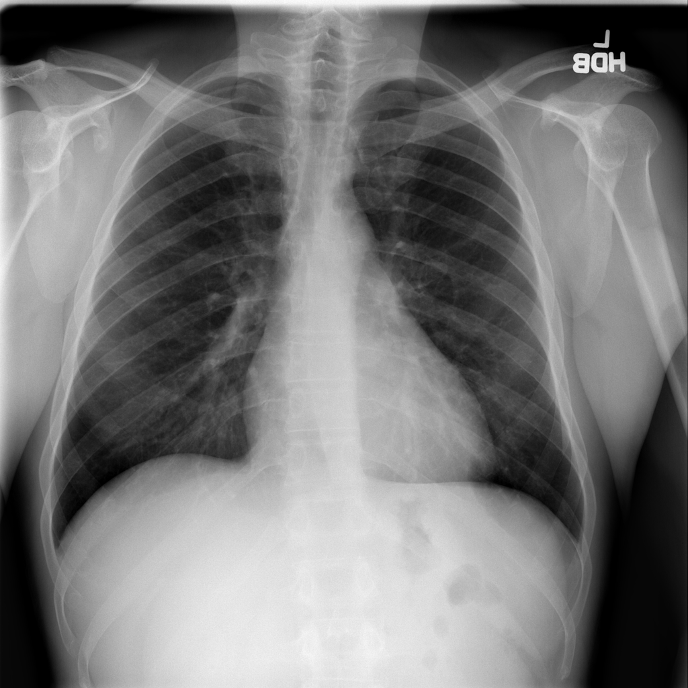

# Proyecto - Detección de Enfermedades pulmonares

# Integrantes:

- García Sánchez Daniel Alfredo
- Guerrero López Jesús Antonio

# Entregables

* [Memoria técnica](dev_model/MEMORIA-TECNICA.md)
* [Documentación API](documentacion-api.md)

# Contexto

El conjunto de imágenes se obtuvo del sitio [Papers with code](https://paperswithcode.com/datasets). Es una página de internet que funge como directorio de datasets para Computer Vision o NLP. También contiene distintor artículos científicos relacionados a temas de ML. Dicha página nos redireccionó a una página del [America´s Research Hospital](https://nihcc.app.box.com/v/ChestXray-NIHCC/) en donde contiene las carpetas donde se encuentran las imágenes con diversas enfermedades y un archivo csv con datos sobre los pacientes y la radiografía tomada.

Una radiografía expone al paciente a una pequeña dosis de radiación ionizante para producir imágenes del interior del cuerpo. Los rayos X son la forma más antigua y la más frecuentada para producir imágenes médicas.

# Objetivo del proyecto

El objetivo principal del proyecto es realizar un modelo de Machine Learning, utilizando Redes Neuronales Convolucionales, para clasificar distintas enfermedades pulmonares utilizando radiografías de la cavidad torácica. Permitiendo la confirmación de diagnósticos médicos y detectando posibles falsos negativos o falsos positivos. 

# Descripción General del Conjunto de Datos

Las radiografías de pecho son uno de los exámenes más accesibles a nivel global. La mayoría de hospitales cuentan con una máquina que pemite realizar este exámen, por lo que son muy utilizadas para detectar y disgnosticar diversas enfermedades pulmonares. Muchos hospitales después de realizar radiografías y su respectivo reporte radiológico, almacenan dichos archivos en Sistemas de Archivado y Comunicación de Imágenes (PACS, por sus siglas en inglés).

Es por ello que Xiaosong Wang, et. al. recopilaron dichos datos en una base de datos denominada "ChestX-ray8" la cual contiene 108,948 imágenes de 32,717 pacientes diferentes con 14 diagnósticos diferentes, en donde un paciente puede tener una o varias enfermedades.

* **Imágenes:** Radiografías de la cavidad torácica
* **Etiquétas:** Cada imágen cuenta con el diagnóstico encontrado, el número de consulta, el ID del paciente, su género, su edad y la posición de la radiografía (AP o PA).

Este proyecto presenta un apoyo hacia el diagnóstico de enfermedades pulmonares. Los resultados arrojados por el modelo no deben sustituir la consulta y diagnóstico de un médico, por el contrario, la intención del proyecto es que médicos calificados confirmen sus diagnósticos utilizando este modelo.