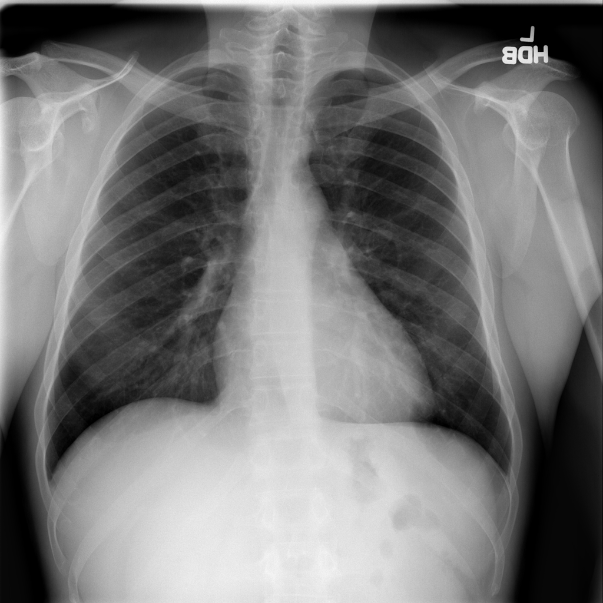
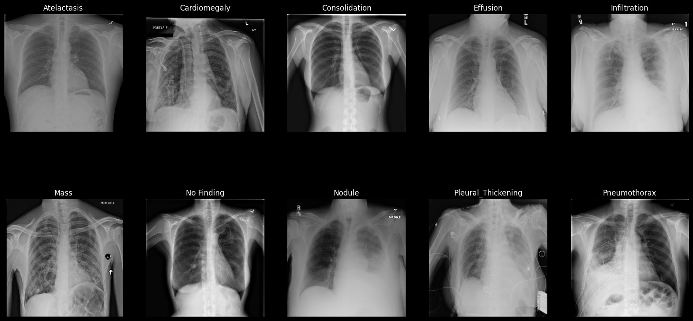
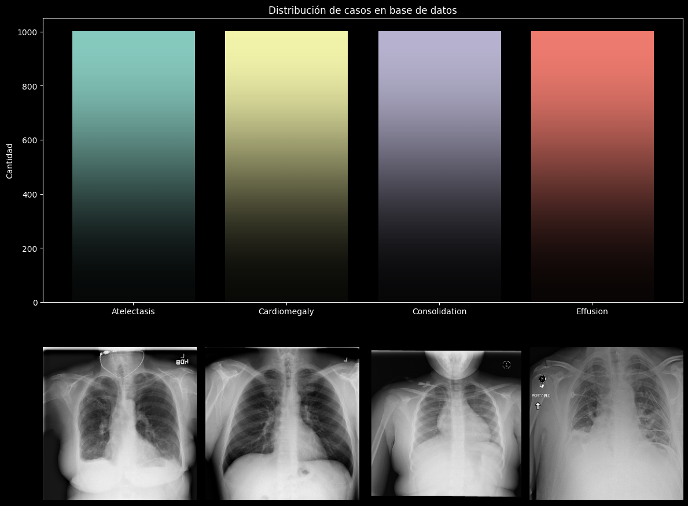
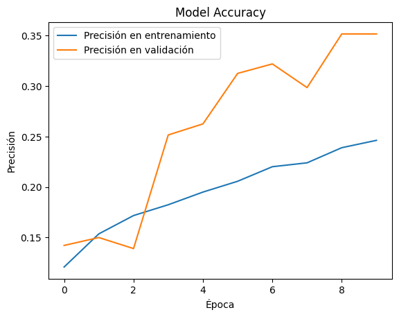

# Memoria Técnica

# Portada 

* Nombre del Proyecto: Clasificación de Enfermedades en cavidad torácica utilizando CNN
* Integrantes:
  * García Sánchez Daniel Alfredo
  * Guerrero López Jesús Antonio

# Índice

* [Portada](#portada)
* [Alcance del Proyecto](#alcance-del-proyecto)
  * [Objetivo](#objetivo)
  * [Introducción](#introducción)
* [Fuentes de Información y procedimmientos aplicados](#fuentes-de-información-y-procedimmientos-aplicados)
  * [Construcción del modelo](#construcción-del-modelo)
  * [Resultados del modelo](#resultados-del-modelo)
  * [Pruebas sobre el modelo](#pruebas-sobre-el-modelo)
  * [Conclusiones](#conclusiones)
* [Conclusiones Generales](#conclusiones-generales)
* [Anexos](#anexos)
* [Glosario](#glosario)

# Alcance del proyecto

## Objetivo

El objetivo de este proyecto es clasificar imágenes de radiografías de cavidad torácica dentro de 10 categorías:
1. Atelectasis
2. Cardiomegalia
3. Consolidación
4. Efusión
5. Infiltración
6. Masa
7. Sin hallazgos radiológicos
8. Nodulo
9. Engrosamiento Pleural
10. Neumotórax

## Introducción

Las radiografías de pecho son uno de los exámenes más accesibles a nivel global. La mayoría de hospitales cuentan con una máquina que pemite realizar este exámen, por lo que son muy utilizadas para detectar y disgnosticar diversas enfermedades pulmonares. Muchos hospitales después de realizar radiografías y su respectivo reporte radiológico, almacenan dichos archivos en Sistemas de Archivado y Comunicación de Imágenes (PACS, por sus siglas en inglés).

# Fuentes de Información y procedimmientos aplicados

El conjunto de datos se descargó del Clinical Center America´s Research Hospital. Este conjunto de datos esta compuesto por los siguientes archivos y carpetas:
* **Data_Entry_2017_v2020.csv** contiene información sobre las radiografías, como el sexo del paciente, su edad, el numero de la consulta y las dimensiones de las imágenes.
* **images** carpeta que contiene archivos .tar.gz con 112,121 radiografías únicas de aproximadamente 38,000 pacientes diferentes. 

La cantidad de datos original para condiciones únicas, es decir, que en la radiografía haya un único diagnóstico son:

| Diagnóstico        | Numero de Radiografias | 
|------------------- |-------|
| No Finding         | 60361 |
| Infiltration       | 9547  |
| Atelectasis        | 4215  |
| Effusion           | 3955  |
| Nodule             | 2705  |
| Pneumothorax       | 2194  |
| Mass               | 2139  |
| Consolidation      | 1310  |
| Pleural_Thickening | 1126  |
| Cardiomegaly       | 1093  |

Por lo que el tamaño de cada categoría es significativamente diferente. Para ello, tomaremos únicamente 1000 imágenes las cuales redimensionamos a un tamaño de 225x225.

## Construcción del modelo

| Layer (type)                                                      | Output Shape        | Param # |   |   |
|-------------------------------------------------------------------|---------------------|---------|---|---|
| rescaling_4 (Rescaling)                                           | (None, 224, 224, 3) | 0       |   |   |
| mobilenetv2_1.00_224 (Functional)                                 | (None, 7, 7, 1280)  | 2257984 |   |   |
| global_average_pooling2d (GlobalAveragePooling2D)                 | (None, 1280)        | 0       |   |   |
| dense_8 (Dense)                                                   | (None, 128)         | 163968  |   |   |
| dropout_3 (Dropout)                                               | (None, 128)         | 0       |   |   |
| dense_9 (Dense)                                                   | (None, 10)          | 1290    |   |   |

Total params: 2,423,242 (9.24 MB)

Trainable params: 165,258 (645.54 KB)

Non-trainable params: 2,257,984 (8.61 MB)

## Resultados del modelo

|   Diagnóstico      | precision |recall | f1-score | support|
|--------------------|--------|----------|---------|-----|
| Atelectasis        | 0.00   | 0.00     | 0.00    | 0   |
| Cardiomegaly       | 0.00   | 0.00     | 0.00    | 0   |
| Consolidation      | 0.27   | 0.40     | 0.32    | 260 |
| Effusion           | 0.30   | 0.19     | 0.23    | 300 |
| Infiltration       | 0.26   | 0.15     | 0.19    | 300 |
| Mass               | 0.22   | 0.19     | 0.21    | 300 |
| No Finding         | 0.26   | 0.27     | 0.26    | 300 |
| Nodule             | 0.23   | 0.21     | 0.22    | 300 |
| Pleural_Thickening | 0.24   | 0.12     | 0.16    | 300 |
| Pneumothorax       | 0.35   | 0.30     | 0.32    | 300 |

## Pruebas sobre el modelo

1. Precisión (Precision)
Una alta precisión significa que el modelo tiene una baja tasa de falsos positivos.

2. Recall (Sensibilidad)
Es la tasa de verdaderos positivos.

3. F1-Score
Es el cociente entre Precisión y Recall.

4. Support
Es el número de ocurrencias de cada clase en el conjunto de datos.

## Conclusiones

Las métricas para evaluar el modelo muestran 0 en todas las métricas para Cardiomegalia y Atelectasis para las diferentes arquitecturas que probamos. La cardiomegalia no se detecta bien en el modelo pues es un padecimiento que afecta al corazón y no a los pulmones, por lo que con la cantidad de imágenes brindadas para Cardiomegalia no permiten a la red diferenciar dicho padecimiento. El posible motivo para que Atelectasis tampoco sea posible identificarlo en la red propuesta es porque la Efusión puede ser causante de Atelectasis, debido a la cantidad de imágenes y el número de categorías, probablemente la red detecte los casos de Atelectasis como Efusión.

# Conclusiones Generales

Los resultados obtenidos pueden parecer bajos, sin embargo, al compararlos con el artículo "ChestX-ray8: Hospital-scale Chest X-ray Database and Benchmarks on
Weakly-Supervised Classification and Localization of Common Thorax Diseases" de Xiaosong Wang, et. al. en donde utilizaron la arquitectura de ResNet-50 para 8 categorías diferentes, lograron una precisión de 0.69 utilizando las 121,121 imágenes. 

El modelo propuesto en este trabajo no es sustitución de un médico, al contrario, es una herramienta más para que puedan corroborar sus análisis, por lo que si combinamos una consulta médica con una evaluación del modelo se podrían generar cambios significativos en el área de la salud para la detección de padecimientos.

# Anexos

* [Conjunto de datos para la detección de enfermedades en cavidad torácica en America´s Research Hospital](https://nihcc.app.box.com/v/ChestXray-NIHCC/)
* [Artículo de Xiaosong Wang et. al.](https://openaccess.thecvf.com/content_cvpr_2017/papers/Wang_ChestX-ray8_Hospital-Scale_Chest_CVPR_2017_paper.pdf)

# Glosario

Este glosario proporciona una breve descripción de los términos médicos utilizados en el proyecto.
1. **Atelectasia**: La atelectasia es el colapso del pulmón o de una parte del pulmón que se llama lóbulo. Surge cuando los pequeños sacos de aire dentro del pulmón, los alvéolos, pierden aire.

2. **Cardiomegalia**: Agrandamiento del corazón, que no es una enfermedad, sino un síntoma de otra afección. La cardiomegalia se debe a un daño en el músculo cardíaco o a cualquier factor que haga que el corazón trabaje más. Las enfermedades cardíacas, como las afecciones del corazón presentes al nacer, el ataque cardíaco y las enfermedades de la válvula cardíaca, pueden hacer que el corazón se agrande y se debilite. El embarazo también puede causar cardiomegalia.

3. **Consolidación**: se refiere a la ocupación del espacio aéreo por productos patológicos (pus, agua, sangre, etc.). La consolidación aparece como un aumento homogéneo de la atenuación parenquimatosa pulmonar (aumento de densidad) que oculta los márgenes de los vasos y las paredes de las vías respiratorias.

4. **Efusión**: Acumulación anormal del líquido entre las capas delgadas del tejido (pleura) que recubre el pulmón y la pared de la cavidad torácica.

5. **Infiltración**: Es la ocupación de los sacos de aire del pulmón (espacios alveolares), que pueden ser ocupados por liquidos como secreciones, sangre o pus.

6. **Nodulo** y **Masa**: Se denomina nódulos a las opacidades de hasta 30mm de diámetro y masas a las mayores, siempre que estén al menos parcialmente delimitadas. Un nódulo pulmonar corresponde por tanto a tumores Etapa I (T1a o T1b). Estas lesiones especialmente las menores de 2cms no son visibles a la Radiografía de Tórax siendo sólo pesquisables mediante TAC.

7. **Engrosamiento Pleural**: Es cuando la membrana que recubre el pulmón se ha engrosado por alguna razón, dentro de las mas frecuentes están las infecciones por tuberculosis y los tumores en esta localización.

8. **Neumotórax**: Un neumotórax puede ser un colapso pulmonar completo o un colapso de solo una parte del pulmón. Se produce cuando el aire se filtra dentro del espacio que se encuentra entre los pulmones y la pared torácica. El aire hace presión en la parte externa del pulmón y causa el colapso.
 